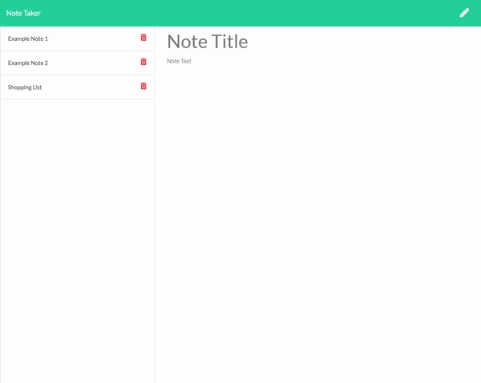

# NoteTaker

## Description
This is a note taking website where a user can take write notes and look at them later. Current functionality includes saving notes, writing new notes, and reviewing previous notes that you have written. 

Webpage link: https://notenotetaker.herokuapp.com/

1. [Usage](#1-usage)
2. [Contributors](#2-Contributors)
3. [License](#3-license)
4. [Questions](#4-questions)

## 1 Usage

### Create a Note

- Click on the Pencil in the upper right to create a new note
- When done, click on the save button to store the note

### Delete a Note

- Clicking the trashcan on a note will delete it

### Read a Note

- You can click in the text of any note to read it's contents

## 2 License 
    Copyright © 2021 Joseph Cordell
    Permission is hereby granted, free of charge, to any person obtaining a copy
    of this software and associated documentation files (the "Software"), to 
    deal in the Software without restriction, including without limitation the 
    rights to use, copy, modify, merge, publish, distribute, sublicense, and/or
    sell copies of the Software, and to permit persons to whom the Software is
    furnished to do so, subject to the following conditions:
    The above copyright notice and this permission notice shall be included in
    all copies or substantial portions of the Software.
    THE SOFTWARE IS PROVIDED "AS IS", WITHOUT WARRANTY OF ANY KIND, EXPRESS OR
    IMPLIED, INCLUDING BUT NOT LIMITED TO THE WARRANTIES OF MERCHANTABILITY,
    FITNESS FOR A PARTICULAR PURPOSE AND NONINFRINGEMENT. IN NO EVENT SHALL THE
    AUTHORS OR COPYRIGHT HOLDERS BE LIABLE FOR ANY CLAIM, DAMAGES OR OTHER
    LIABILITY, WHETHER IN AN ACTION OF CONTRACT, TORT OR OTHERWISE, ARISING
    FROM, OUT OF OR IN CONNECTION WITH THE SOFTWARE OR THE USE OR OTHER DEALINGS
    IN THE SOFTWARE.

## 3 Contributors
[Joseph Cordell](github.com/josephcordell)

## 4 Questions 
- Github Profile: [JosephCordell](github.com/josephcordell)
- [Send an email to joseph@jcordell.com](mailto:joseph@jcordell.com)
- [File an issue](github.com/josephcordell/README_Generator/issues)
